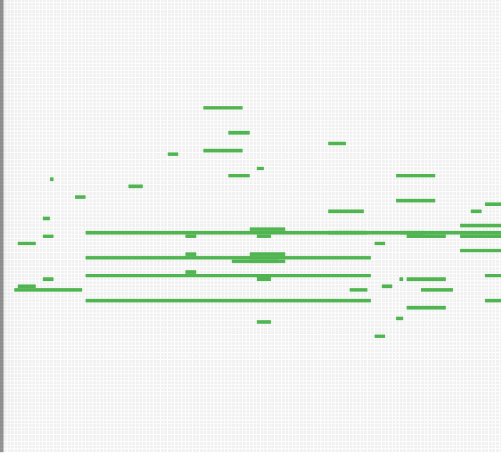
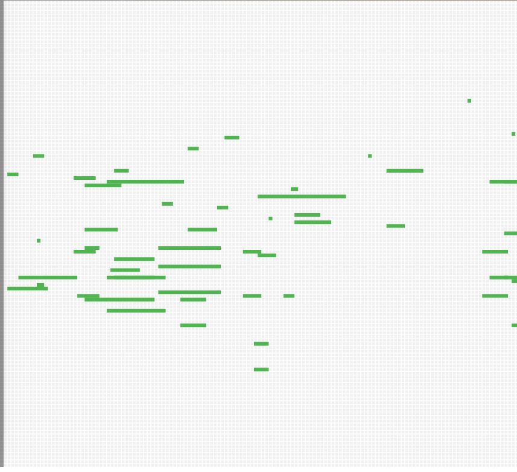
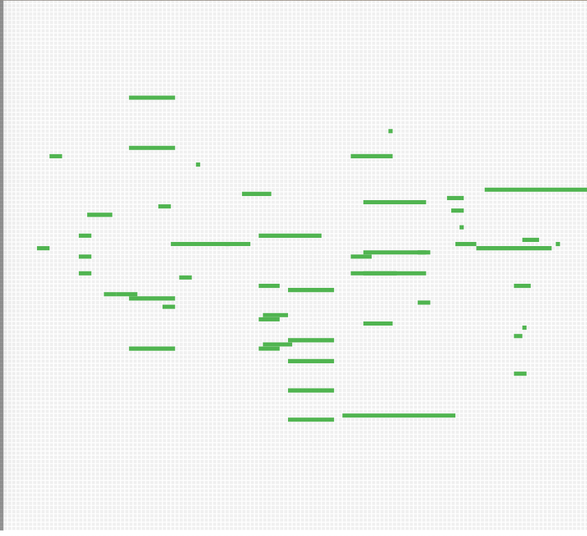

# CMPM147-asg5
The MarkovChain class works as one might expect. It reads the input data into a dictionary when it's created and, for each unique token in the input, builds a sub-dictionary of all the unique tokens which succeed it and the number of times they do so, throughout all the input songs. It also adds special tokens which signify the start and end of a song. When sample() is called, it repeatedly looks at the current token (initially start) and randomly chooses one of the tokens in its sub-dictionary entry to be the next currentToken, taking into account the number of times it occurred in the input data. For example, if the token "46_4" was only in the input data eight times, and was succeeded by "." in six of those instances, the algorithm has a 75% chance of adding "." to the song after "46_4". Additionally, the length of the generated song is capped at 2000 tokens to preclude a situation where the page seemingly takes forever to load.

All MIDI files are from [Kenzie Smith's Website](https://kenziesmithpiano.com/anime-midi/).

## Screenshots

